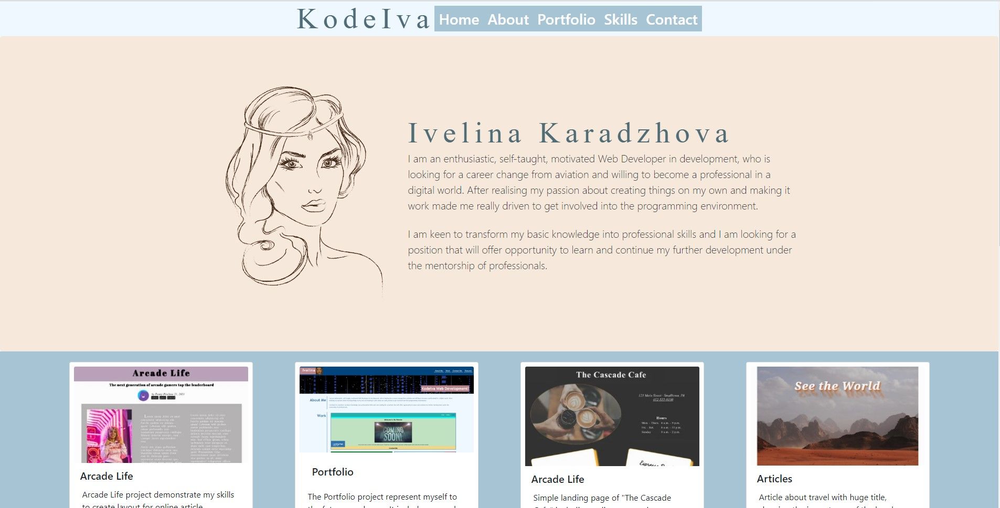
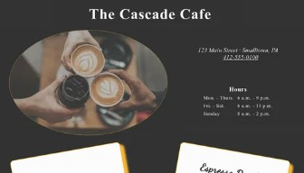

# Bootstrap-Portfolio

## Description

This Bootstrap-Portfolio project represents my skills of using CSS framework - Boostrap. It includes examples of other smaller projects to show the usage . 
.

## Screenshots

### Bootstrap-Portfolio 




## Links

- Solution URL: [Solution URL here](https://github.com/KodeIva/Bootstrap-Portfolio)
- Live Site URL: [Live site URL here](https://kodeiva.github.io/Bootstrap-Portfolio/)


## Codes used

- Semantic HTML5 markup
- CSS custom properties
- Bootsrap
- Flexbox
- CSS Grid

### Bootstrap CDN

```html
<link rel="stylesheet" href="https://stackpath.bootstrapcdn.com/bootstrap/4.3.1/css/bootstrap.min.css"
   integrity="sha384-ggOyR0iXCbMQv3Xipma34MD+dH/1fQ784/j6cY/iJTQUOhcWr7x9JvoRxT2MZw1T" crossorigin="anonymous">
  <link href="https://fonts.googleapis.com/css?family=Anton|Jura&display=swap" rel="stylesheet">
```

### Navbar
```html
<!-- N A V B A R -->
 <nav class="navbar d-flex justify-content-center">
  <h1 class="text-center display-4">KodeIva</h1>
   <ul class="nav d-flex justify-content-center ">   
    <li class="list-item m-2">
     <a href="#" class="nav-item nav-link text-white h3">Home</a>
    </li>
    <li class="list-item m-2">
     <a href="#about" class="nav-item nav-link text-white h3">About</a>
    </li>
    <li class="list-item m-2">
     <a href="#portfolio" class="nav-item nav-link text-white h3">Portfolio</a>
    </li>
    <li class="list-item m-2">
     <a href="#skills" class="nav-item nav-link text-white h3">Skills</a>
    </li>
    <li class="list-item m-2">
     <a href="#contact" class="nav-item nav-link text-white h3">Contact</a>
    </li>
  </ul>
</nav>
```

### Djumbotron
```html
<section class="hero" id="about">
   <div class="jumbotron  p-5">
    <div class="container d-flex justify-content-center">
     
     <div class="align-self-center">
        <h1 class="display-4">Ivelina Karadzhova</h1>
        <p class="lead">
          I am an enthusiastic, self-taught, motivated Web Developer in  development, who is looking for a career change from aviation and willing to become a professional in a digital world. After realising my passion about creating things on my own and making it work made me really driven to get involved into the programming environment.
        </p>
        <br>
        <p class="lead">I am keen to transform my basic knowledge into     professional skills and I am looking for a position that will offer opportunity to learn and continue my further development under the mentorship of professionals.</p>
        </p>
     </div>
    </div>
   </div>
  </section>
```

### Portfolio section example
```html
<div class="col card p-2" >
  
  <div class="card-body p-2">
   <h5 class="card-title p-1">Arcade Life</h5>
   <p class="card-text p-2">Simple landing page of "The Cascade Cafe" including online menu where customers can see the selection of coffees and bakery in the shop.
   </p>
   <a href="https://codepen.io/Iva-19/pen/ExmPNmm" class="btn p-1 text-light">More Info...</a>
  </div>
 </div>
```

## Installation

 N/A


## Credits

N/A


## License
[MIT](https://choosealicense.com/licenses/mit/)
